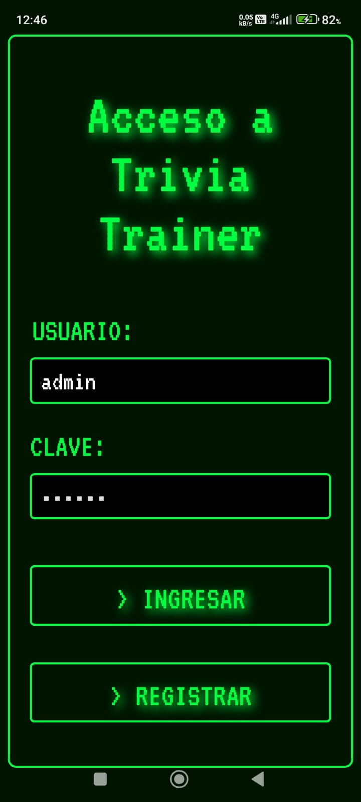
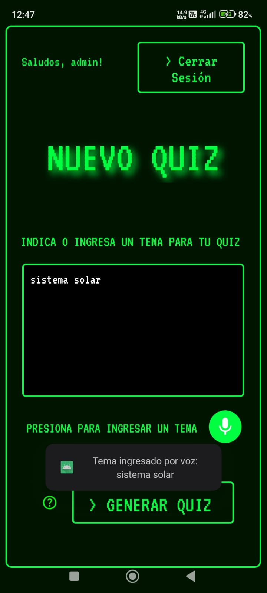
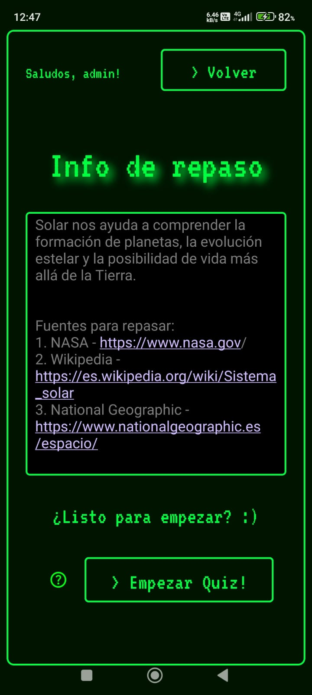
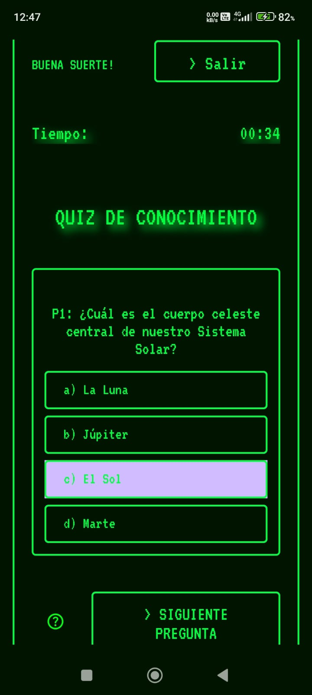
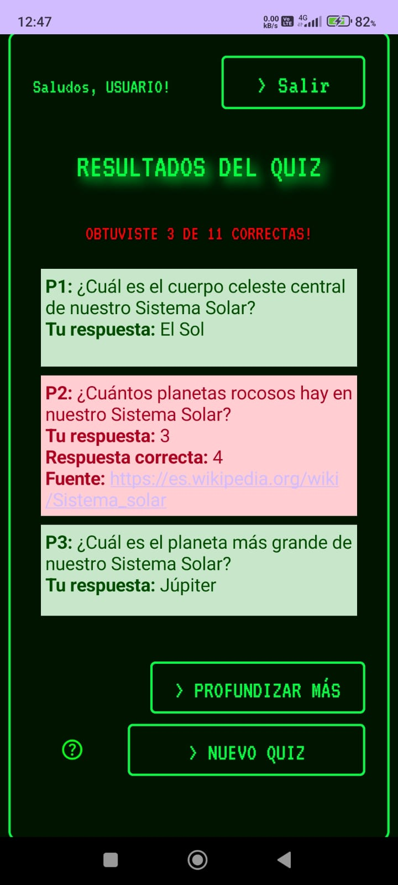

# Proyecto de Generador de Quiz Trivia Trainer
TriviaTrainer es una aplicación innovadora de preguntas y respuestas que
busca transformar la experiencia tradicional de las trivias mediante una
interfaz multimodal, permitiendo al usuario seleccionar temas a través de voz y texto.
## Curso IHC
#### Para compilar el proyecto es necesario que obtengas tu api_key de gemini. Obtenla en: https://ai.google.dev/gemini-api/docs/api-key

#### Una vez tengas tu api_key crea un archivo apikey.properties con la siguiente linea:
`API_KEY=TU_API_KEY`
### Previews:

  
  
  

  
  
  

### Releases:
En progreso