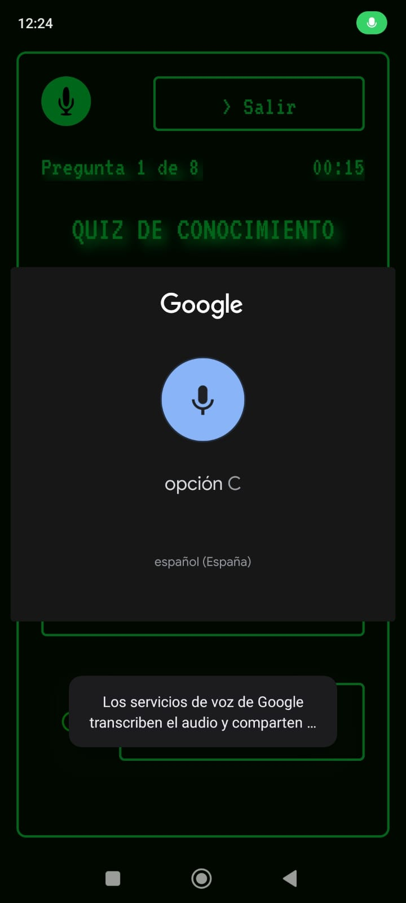

# Proyecto Generador de Quizzes en Lenguaje Natural Trivia Trainer
TriviaTrainer es una aplicación innovadora de preguntas y respuestas que
busca transformar la experiencia tradicional de las trivias mediante una
interfaz multimodal, permitiendo al usuario seleccionar temas a través de voz y texto ajustando
la dificultad de las preguntas segun el desempeño del usuario y generando dinámicamente las preguntas
sobre el tema elegido. 
## Requisitos para compilar el proyecto
Para compilar el proyecto es necesario que obtengas tu api_key de gemini. Obtenla en: https://ai.google.dev/gemini-api/docs/api-key

Una vez tengas tu api_key crea un archivo apikey.properties que contenga la siguiente linea:
`API_KEY=TU_API_KEY`
y lo colocas en la raíz del proyecto.

También necesitarás un archivo google-services.json que necesitarás descargar de https://support.google.com/firebase/answer/7015592?hl=es-419&sjid=2858742887088263636-SA#zippy=%2Cin-this-article%2Cen-este-art%C3%ADculo (Cómo obtener el archivo de configuración de tu app de Android).  Donde crearás un proyecto con el nombre `proyectotriviatrainer`. Coloca este archivo en el path TriviaTrainer/app.

Finalmente, puedes importar el proyecto en android studio, buildearlo y ejecutarlo.
### Previews:

  
  
  

  
  
  

  
  
  

### Features:
- Interfaz de voz
- Interfaz con LLM
- Adaptación al Usuario
- Interfaz de Ayuda contextual
- Gamificación
- Interfaces hápticas